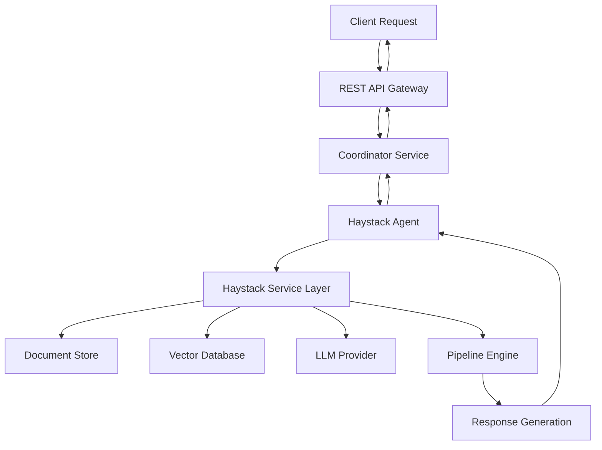

# MCP Distributed System - Haystack AI Integration Architecture

## 📋 **Executive Summary**

This document outlines the integration of Haystack AI framework into the MCP Distributed System, adding enterprise-grade AI capabilities including Retrieval-Augmented Generation (RAG), document search, question answering, and semantic search through a dedicated Haystack agent and service layer.

## 🎯 **Integration Overview**

### **What is Haystack?**
Haystack is an open-source AI orchestration framework that enables building production-ready LLM applications with:
- Retrieval-Augmented Generation (RAG) pipelines
- Multi-modal AI capabilities (text, images, audio)
- Modular component architecture
- Enterprise-grade monitoring and deployment
- Integration with major LLM providers and vector databases

### **Integration Approach**
- **Dedicated Agent**: New `haystack` agent type for AI/RAG operations
- **Service Extension**: Extend integration service with Haystack operations
- **Pipeline Management**: Reusable Haystack pipelines for different use cases
- **Data Integration**: Connect with existing PostgreSQL and add vector database support

## 🏗️ **System Architecture**

### **High-Level Architecture**
```
┌─────────────────────────────────────────────────────────────────┐
│                    MCP Distributed System                       │
├─────────────────────────────────────────────────────────────────┤
│                                                                 │
│  ┌─────────────┐  ┌─────────────┐  ┌─────────────┐             │
│  │   REST API  │  │ Coordinator │  │ Integration │             │
│  │ (Port 8000) │  │(Port 50051) │  │(Port 50200) │             │
│  └─────────────┘  └─────────────┘  └─────────────┘             │
│                                                                 │
│  ┌─────────────────────────────────────────────────────────────┐ │
│  │                    Agent Layer                              │ │
│  ├─────────────┬─────────────┬─────────────┬─────────────────┤ │
│  │ Manager     │ Frontend    │ Backend     │ **NEW**         │ │
│  │ Database    │ DevOps      │ QA          │ **Haystack**    │ │
│  │ Integration │             │             │ **(Port 50107)**│ │
│  └─────────────┴─────────────┴─────────────┴─────────────────┘ │
│                                                                 │
│  ┌─────────────────────────────────────────────────────────────┐ │
│  │                 Haystack Service Layer                     │ │
│  ├─────────────┬─────────────┬─────────────┬─────────────────┤ │
│  │ RAG         │ Document    │ QA          │ Semantic        │ │
│  │ Pipelines   │ Search      │ Systems     │ Search          │ │
│  └─────────────┴─────────────┴─────────────┴─────────────────┘ │
│                                                                 │
│  ┌─────────────────────────────────────────────────────────────┐ │
│  │                  Data & Storage Layer                      │ │
│  ├─────────────┬─────────────┬─────────────┬─────────────────┤ │
│  │ PostgreSQL  │ Vector DB   │ Document    │ Model           │ │
│  │ (Metadata)  │ (Embeddings)│ Store       │ Cache           │ │
│  └─────────────┴─────────────┴─────────────┴─────────────────┘ │
└─────────────────────────────────────────────────────────────────┘
```

### **Component Interaction Flow**


## 🔧 **Technical Implementation**

### **New Agent Type**
```python
class AgentType(Enum):
    MANAGER = "manager"
    FRONTEND = "frontend"
    BACKEND = "backend"
    DATABASE = "database"
    DEVOPS = "devops"
    INTEGRATION = "integration"
    QA = "qa"
    HAYSTACK = "haystack"  # NEW
```

**Haystack Agent Capabilities:**
- `rag`: Retrieval-Augmented Generation
- `document_search`: Semantic and keyword search
- `question_answering`: QA over documents
- `document_processing`: Ingestion and preprocessing
- `pipeline_management`: Pipeline creation and execution
- `semantic_search`: Vector-based similarity search
- `summarization`: Document and content summarization
- `multimodal`: Image and audio processing

### **Data Architecture**

#### **Database Schema Extensions**
```sql
-- Haystack documents table
CREATE TABLE haystack_documents (
    id UUID PRIMARY KEY DEFAULT uuid_generate_v4(),
    filename VARCHAR(255) NOT NULL,
    content_type VARCHAR(100),
    content TEXT,
    metadata JSONB DEFAULT '{}',
    embeddings_id VARCHAR(255),
    document_store_id VARCHAR(255),
    created_at TIMESTAMP WITH TIME ZONE DEFAULT NOW(),
    updated_at TIMESTAMP WITH TIME ZONE DEFAULT NOW()
);

-- Haystack pipelines table
CREATE TABLE haystack_pipelines (
    id UUID PRIMARY KEY DEFAULT uuid_generate_v4(),
    name VARCHAR(255) NOT NULL,
    type VARCHAR(100) NOT NULL, -- 'rag', 'qa', 'search', 'custom'
    configuration JSONB NOT NULL,
    is_active BOOLEAN DEFAULT true,
    created_by VARCHAR(255),
    created_at TIMESTAMP WITH TIME ZONE DEFAULT NOW(),
    updated_at TIMESTAMP WITH TIME ZONE DEFAULT NOW()
);

-- Haystack query logs
CREATE TABLE haystack_queries (
    id UUID PRIMARY KEY DEFAULT uuid_generate_v4(),
    pipeline_id UUID REFERENCES haystack_pipelines(id),
    query TEXT NOT NULL,
    response TEXT,
    execution_time_ms INTEGER,
    tokens_used INTEGER,
    cost_usd DECIMAL(10,4),
    metadata JSONB DEFAULT '{}',
    created_at TIMESTAMP WITH TIME ZONE DEFAULT NOW()
);

-- Haystack embeddings cache
CREATE TABLE haystack_embeddings (
    id UUID PRIMARY KEY DEFAULT uuid_generate_v4(),
    content_hash VARCHAR(64) UNIQUE NOT NULL,
    content TEXT NOT NULL,
    embedding VECTOR(1536), -- Adjust size based on model
    model_name VARCHAR(100) NOT NULL,
    created_at TIMESTAMP WITH TIME ZONE DEFAULT NOW()
);
```

#### **Vector Database Integration**
- **Primary**: Weaviate (Docker-friendly, open-source)
- **Alternatives**: Pinecone (cloud), Chroma (lightweight), Qdrant (performance)
- **Schema Design**: Collections per document type with metadata filtering

### **Protocol Buffer Extensions**
```protobuf
// Add to agent.proto

// Haystack-specific message types
message HaystackDocumentRequest {
    string filename = 1;
    string content_type = 2;
    bytes content = 3;
    map<string, string> metadata = 4;
    string pipeline_id = 5;
}

message HaystackQueryRequest {
    string pipeline_id = 1;
    string query = 2;
    map<string, string> parameters = 3;
    int32 max_results = 4;
}

message HaystackPipelineRequest {
    string name = 1;
    string type = 2; // 'rag', 'qa', 'search', 'custom'
    map<string, string> configuration = 3;
}

message HaystackResponse {
    bool success = 1;
    string message = 2;
    map<string, string> result_data = 3;
    repeated HaystackDocument documents = 4;
    google.protobuf.Timestamp timestamp = 5;
}

message HaystackDocument {
    string id = 1;
    string filename = 2;
    string content = 3;
    map<string, string> metadata = 4;
    float relevance_score = 5;
}

// Extend existing services
service CoordinatorService {
    // ... existing methods
    rpc ProcessHaystackTask(HaystackQueryRequest) returns (HaystackResponse);
}

service IntegrationService {
    // ... existing methods
    rpc ExecuteHaystackOperation(HaystackQueryRequest) returns (HaystackResponse);
}
```

## 📡 **API Design**

### **REST API Endpoints**
```
# Document Management
POST   /api/v1/haystack/documents/ingest         # Upload and process documents
GET    /api/v1/haystack/documents               # List documents with filters
GET    /api/v1/haystack/documents/{id}          # Get specific document
DELETE /api/v1/haystack/documents/{id}          # Delete document
PUT    /api/v1/haystack/documents/{id}/metadata # Update document metadata

# Search and Query
POST   /api/v1/haystack/search                  # Semantic/keyword search
POST   /api/v1/haystack/qa                      # Question answering
POST   /api/v1/haystack/rag                     # RAG queries
POST   /api/v1/haystack/summarize               # Document summarization

# Pipeline Management
GET    /api/v1/haystack/pipelines               # List pipelines
POST   /api/v1/haystack/pipelines               # Create pipeline
GET    /api/v1/haystack/pipelines/{id}          # Get pipeline details
PUT    /api/v1/haystack/pipelines/{id}          # Update pipeline
DELETE /api/v1/haystack/pipelines/{id}          # Delete pipeline
POST   /api/v1/haystack/pipelines/{id}/run      # Execute pipeline
GET    /api/v1/haystack/pipelines/{id}/status   # Pipeline status

# Analytics and Monitoring
GET    /api/v1/haystack/analytics/queries       # Query analytics
GET    /api/v1/haystack/analytics/performance   # Performance metrics
GET    /api/v1/haystack/analytics/costs         # Cost analysis
```

### **API Request/Response Examples**
```json
// Document Ingestion
POST /api/v1/haystack/documents/ingest
{
    "filename": "product_manual.pdf",
    "content_type": "application/pdf",
    "content": "base64_encoded_content",
    "metadata": {
        "category": "documentation",
        "product": "widget_v2",
        "language": "en"
    },
    "pipeline": "document_processing"
}

// RAG Query
POST /api/v1/haystack/rag
{
    "query": "How do I configure the authentication system?",
    "pipeline_id": "auth_docs_rag",
    "parameters": {
        "max_results": 5,
        "temperature": 0.7,
        "model": "gpt-4"
    }
}

// Response
{
    "success": true,
    "answer": "To configure the authentication system, you need to...",
    "sources": [
        {
            "document_id": "uuid-123",
            "filename": "auth_guide.md",
            "relevance_score": 0.95,
            "content_snippet": "Authentication configuration steps..."
        }
    ],
    "metadata": {
        "execution_time_ms": 1250,
        "tokens_used": 1500,
        "model_used": "gpt-4"
    }
}
```

## 🚀 **Implementation Phases**

### **Phase 1: Core Integration (Week 1)**
**Deliverables:**
- [ ] Haystack agent implementation with basic capabilities
- [ ] Protocol buffer extensions for Haystack operations
- [ ] Basic document ingestion and storage
- [ ] Simple RAG pipeline implementation
- [ ] Agent registration and health checks

**Technical Tasks:**
1. Update `distributed/types.py` with Haystack agent type
2. Implement `grpc_services/haystack_service.py`
3. Create `haystack_integration/` module structure
4. Add Haystack to agent orchestration
5. Basic REST API endpoints

### **Phase 2: Pipeline Management (Week 1)**
**Deliverables:**
- [ ] Pre-built pipeline library (RAG, QA, Search, Summarization)
- [ ] Pipeline configuration and management APIs
- [ ] Dynamic pipeline creation and execution
- [ ] Pipeline status monitoring and logging

**Technical Tasks:**
1. Implement `haystack_integration/pipelines.py`
2. Create pipeline templates and presets
3. Pipeline execution engine
4. Pipeline management REST endpoints
5. Pipeline analytics and monitoring

### **Phase 3: Document Management (Week 2)**
**Deliverables:**
- [ ] Multi-format document ingestion (PDF, DOCX, TXT, HTML, MD)
- [ ] Document preprocessing and chunking
- [ ] Metadata extraction and management
- [ ] Vector database integration (Weaviate)
- [ ] Document version control and updates

**Technical Tasks:**
1. Document processing pipeline
2. Vector database setup and integration
3. Embedding generation and storage
4. Document CRUD operations
5. Search optimization

### **Phase 4: Advanced Features (Week 2)**
**Deliverables:**
- [ ] Multi-modal pipeline support (images, audio)
- [ ] Agent workflows and tool calling
- [ ] Advanced RAG techniques (hybrid search, re-ranking)
- [ ] Model management and switching
- [ ] Performance optimization

**Technical Tasks:**
1. Multi-modal processing components
2. Agent workflow orchestration
3. Advanced RAG pipeline implementations
4. Model provider integrations
5. Performance tuning and caching

### **Phase 5: Enterprise Features (Week 3)**
**Deliverables:**
- [ ] Comprehensive monitoring and analytics
- [ ] Cost tracking and optimization
- [ ] A/B testing framework for models
- [ ] Security and access controls
- [ ] Production deployment guides

**Technical Tasks:**
1. Monitoring and metrics collection
2. Cost tracking implementation
3. A/B testing infrastructure
4. Security layer implementation
5. Documentation and deployment guides

## 🐳 **Container Architecture**

### **Updated Docker Compose**
```yaml
version: '3.8'

services:
  # Existing services...

  # Vector Database
  weaviate:
    image: cr.weaviate.io/semitechnologies/weaviate:1.24.1
    container_name: mcp-weaviate
    environment:
      - QUERY_DEFAULTS_LIMIT=25
      - AUTHENTICATION_ANONYMOUS_ACCESS_ENABLED=true
      - PERSISTENCE_DATA_PATH=/var/lib/weaviate
      - DEFAULT_VECTORIZER_MODULE=none
      - ENABLE_MODULES=text2vec-openai,text2vec-cohere,qna-openai
    ports:
      - "8080:8080"
    volumes:
      - weaviate_data:/var/lib/weaviate
    networks:
      - mcp-network
    restart: unless-stopped

  # Redis for caching (enhanced for Haystack)
  redis:
    image: redis:7-alpine
    container_name: mcp-redis
    ports:
      - "6379:6379"
    volumes:
      - redis_data:/data
    networks:
      - mcp-network
    restart: unless-stopped
    command: redis-server --appendonly yes --maxmemory 512mb --maxmemory-policy allkeys-lru

volumes:
  weaviate_data:
    driver: local
```

### **Dependencies**
```txt
# Add to requirements.txt
haystack-ai>=2.0.0
weaviate-client>=4.4.0
sentence-transformers>=2.2.0
torch>=2.0.0
transformers>=4.25.0
openai>=1.0.0
anthropic>=0.8.0
python-multipart>=0.0.6
pypdf>=3.0.0
python-docx>=0.8.11
beautifulsoup4>=4.12.0
markdown>=3.5.0
numpy>=1.24.0
faiss-cpu>=1.7.4
```

## 🔄 **Inter-Agent Collaboration**

### **Collaboration Scenarios**

#### **Document Analysis Workflow**
```
1. Manager Agent requests competitive analysis
2. Haystack Agent ingests competitor documents
3. Haystack Agent performs RAG-based analysis
4. Manager Agent receives insights and recommendations
5. Frontend Agent creates dashboard visualization
6. Backend Agent integrates insights into recommendation API
```

#### **Customer Support Enhancement**
```
1. Integration Agent receives customer query via Slack
2. Haystack Agent searches knowledge base using RAG
3. QA Agent validates response accuracy
4. Integration Agent sends response back to customer
5. Manager Agent logs interaction for improvement
```

#### **Content Generation Workflow**
```
1. Frontend Agent needs content for new feature
2. Haystack Agent searches existing documentation
3. Haystack Agent generates content using RAG
4. QA Agent reviews generated content
5. Backend Agent stores approved content
6. DevOps Agent deploys updated content
```

### **Task Distribution Examples**
```python
# Manager creates research task
research_task = Task(
    title="Analyze competitor API documentation",
    type="haystack",
    description="Ingest competitor API docs and provide feature comparison",
    metadata={
        "pipeline": "competitive_analysis_rag",
        "documents": ["competitor_api_docs/*"],
        "analysis_type": "feature_comparison",
        "output_format": "structured_report"
    }
)

# Content generation task
content_task = Task(
    title="Generate FAQ from documentation",
    type="haystack",
    description="Create FAQ section from existing documentation",
    metadata={
        "pipeline": "faq_generation",
        "source_documents": ["user_guide.md", "api_reference.md"],
        "target_audience": "developers",
        "max_questions": 20
    }
)
```

## 📊 **Monitoring and Analytics**

### **Key Metrics**
- **Performance**: Query response time, pipeline execution time
- **Accuracy**: RAG relevance scores, user feedback ratings
- **Usage**: Query volume, popular pipelines, document access patterns
- **Cost**: Token usage, API calls, compute resources
- **System Health**: Agent status, pipeline success rates, error rates

### **Dashboards**
- **Operations Dashboard**: Real-time system status and performance
- **Analytics Dashboard**: Usage patterns and insights
- **Cost Dashboard**: Token usage and cost optimization
- **Quality Dashboard**: Accuracy metrics and user feedback

## 🔒 **Security Considerations**

### **Data Security**
- **Document Encryption**: Encrypt documents at rest and in transit
- **Access Controls**: Role-based access to documents and pipelines
- **API Authentication**: Secure API endpoints with JWT tokens
- **Audit Logging**: Comprehensive audit trail for all operations

### **Model Security**
- **API Key Management**: Secure storage of LLM provider API keys
- **Rate Limiting**: Prevent abuse and control costs
- **Content Filtering**: Filter sensitive information from queries/responses
- **Data Residency**: Control where data is processed and stored

## 🎯 **Success Criteria**

### **Functional Requirements**
- [ ] Haystack agent successfully integrates with existing system
- [ ] Document ingestion supports major formats (PDF, DOCX, TXT, HTML, MD)
- [ ] RAG pipeline produces relevant and accurate responses
- [ ] Search functionality returns ranked results
- [ ] Pipeline management APIs are fully functional
- [ ] Multi-agent collaboration workflows operate correctly

### **Performance Requirements**
- Query response time < 2 seconds for simple searches
- RAG response time < 5 seconds for complex queries
- Document ingestion rate > 100 documents/minute
- System maintains <15% performance overhead
- 99.9% uptime for Haystack services

### **Quality Requirements**
- RAG accuracy > 85% on evaluation dataset
- Search relevance > 90% for top-3 results
- Pipeline success rate > 95%
- User satisfaction score > 4.0/5.0

## 📚 **Documentation Deliverables**

1. **API Documentation**: Complete OpenAPI specification for all endpoints
2. **User Guide**: How to use Haystack features in MCP system
3. **Pipeline Cookbook**: Examples and templates for common use cases
4. **Deployment Guide**: Production deployment and scaling instructions
5. **Integration Examples**: Sample applications and workflows
6. **Troubleshooting Guide**: Common issues and solutions

## 🔮 **Future Enhancements**

### **Roadmap Items**
- **Multi-language Support**: International document processing
- **Advanced Analytics**: Machine learning insights and predictions
- **Custom Models**: Fine-tuned models for specific domains
- **Federated Search**: Search across multiple external systems
- **Voice Interface**: Speech-to-text query input
- **Knowledge Graphs**: Entity extraction and relationship mapping

### **Integration Opportunities**
- **CRM Integration**: Customer data enrichment with RAG
- **BI Tools**: Analytics dashboard integration
- **Workflow Automation**: Zapier/Make.com connectors
- **Mobile SDK**: Mobile app integration libraries

---

## 📝 **Implementation Notes**

This architecture document serves as the blueprint for integrating Haystack AI capabilities into the MCP Distributed System. The implementation will follow the phased approach outlined above, with each phase building upon the previous one to create a comprehensive AI-enhanced multi-agent system.

The integration maintains the existing system's architecture while adding powerful AI capabilities that can be leveraged by all agents in the system. The modular design ensures that Haystack features can be used independently or in combination with other agent capabilities.

**Last Updated**: August 2, 2025
**Version**: 1.0
**Status**: Implementation Ready
